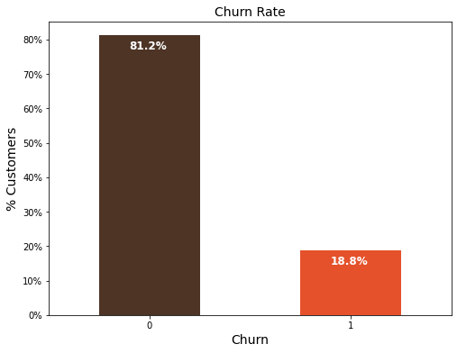
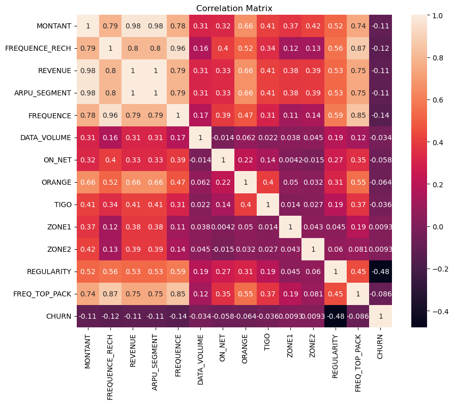

[](https://github.com/justinjabo250)
[](https://www.linkedin.com/in/jabo-justin-2815341a2/) 
[](https://github.com/justinjabo250?tab=repositories)
[](https://medium.com/@jabojustin250)
[](https://huggingface.co/spaces/Justin-J/Using-the-Streamlit-application-and-machine-learning-project-forecast-and-analyze-customer-Churn)
[](https://justinjabo250.github.io/Developing-a-web-application-for-an-online-portfolio./)
[](https://github.com/justinjabo250)


# Using the Streamlit application and machine learning project, forecast and analyze customer Churn. 

<p align="center">
   
</p>

## Project Overview

Our project's objective is to determine the probability that a client would leave the business, the primary churn indicators, and viable retention tactics. One of the main issues facing the telecom sector is churn. Studies reveal that the average monthly churn rate for the top 4 US wireless service providers is between 1.9% and 2%.

One of the biggest expenses for a corporation is customer turnover. Customer churn, sometimes called customer attrition or customer turnover, is the percentage of customers that ceased utilizing the product or service offered by your business within a predetermined time period. For example, if you had 500 clients at the start of the year and finished with 480, that means 4% of the 500 clients departed. The business would benefit greatly from being able to plan its retention campaigns if we could anticipate with reasonable accuracy when and why a client would go.


<p align="center">
     
</p>


This solution would assist this telecom company in providing better customer service by identifying those clients who may be considering leaving.

<p align="center">
     
</p>

## The presentation follows the following outline

- [Project Overview](#project-overview)
- [Getting Started](#getting-started)
- [Data](#data)
- [Modeling](#modeling)
- [Evaluation](#evaluation)
- [Deployment](#deployment)


## Objectives

- Objective 1: Data Exploration
- Objective 2: Data Preprocessing
- Objective 3: Model Selection and Training
- Objective 4: Model Evaluation
- Objective 5: Results & Analysis
- Objective 6: Deployment and Future Improvements


## Summary
| Code | Name                                                | Summary of the work                                                                                          |                                                                                              Streamlit App    |                                                                                                |
|------|-----------------------------------------------------|------------------------------------------------------------------------------------------------------------|--------------------------------------------------------------------------------------------------------------|-------------------------------------------------------------------------------------------------------------|
| Capstone  | Expressor Customer Churn Prediction, ML Approach     | [Summary_PPT]() |  [Streamlit App](https://huggingface.co/spaces/Justin-J/Using-the-Streamlit-application-and-machine-learning-project-forecast-and-analyze-customer-Churn)      |


## Project Setup

To set up the project environment, follow these steps:

1. Clone the repository:

git clone my_github 

```bash 
https://github.com/justinjabo250/Using-the-Streamlit-application-and-machine-learning-project-forecast-and-analyze-customer-Churn
```

2. Install the required dependencies:

```bash
pip install -r requirements.txt
```

3. Create a virtual environment:

- **Windows:**
  ```bash
  python -m venv venv
  venv\Scripts\activate
  ```

You can copy each command above and run them in your terminal to easily set up the project environment.


## Data

The data set used in this project was sourced from the [Zindi](https://zindi.africa/competitions/customer-churn-prediction-challenge-for-azubian).

## Data set Description

| Column Name     | Type   | Description                                                              |
|-----------------|-----------------|--------------------------------------------------------------------------|
| REGION          | Categorical     | The location of each client                                               |
| TENURE          | Numeric         | Duration with the network                                                 |
| MONTANT         | Numeric         | Top-Up Amount                                                             |
| FREQUENCE_RECH  | Numeric         | The number of times a customer refilled                                    |
| REVENUE         | Numeric         | Monthly income of each client                                             |
| ARPU_SEGMENT    | Numeric         | Income over 90 days divided by 3                                          |
| FREQUENCE       | Numeric         | Number of times the client has made an income                              |
| DATA_VOLUME     | Numeric         | Number of connections                                                     |
| ON_NET          | Numeric         | Inter Expresso call                                                       |
| ORANGE          | Numeric         | Calls to Orange                                                           |
| TIGO            | Numeric         | Calls to Tigo                                                             |
| ZONE1           | Numeric         | Calls to Zone1                                                            |
| ZONE2           | Numeric         | Calls to Zone2                                                            |
| MRG             | Categorical     | A client who is going                                                      |
| REGULARITY      | Numeric         | Number of times the client is active for 90 days                           |
| TOP_PACK        | Categorical     | The most active packs                                                     |
| FREQ_TOP_PACK   | Numeric         | Number of times the client has activated the top pack packages             |
| CHURN           | Binary          | Target variable to predict - Churn (Positive: customer will churn, Negative: customer will not churn) |


## Exploratory Data Analysis

During the exploratory data analysis (EDA) phase, a comprehensive investigation of the churn dataset was conducted to gain insights through various types of analyses.

- **Univariate analysis:** A thorough examination of each variable individually was performed. Summary statistics such as mean, median, standard deviation, and quartiles were calculated to understand the central tendency and spread of the data.

<p align="center">
  
</p>

- **Bivariate analysis:** Relationships between pairs of variables were explored to identify patterns and potential predictor variables for sepsis classification.

<p align="center">
  
</p>

- **Multivariate analysis:** Relationships among multiple variables were examined simultaneously, allowing for a deeper understanding of their interactions and impact on sepsis.

<p align="center">
  
</p>

### Hypotheses:
1. Customers with longer tenure are less likely to churn than those with short tenure.

2. Customers with lesser income are likely to churn than those who have higher

These hypotheses, along with the results of the EDA, contribute to a deeper understanding of the dataset and provide valuable insights for further analysis and model development.

### Business Questions
1. What is the relation of the preditor class (Churn) to other variable
- Churn rate
- Churn vrs. Tenure
2. What type of services offered by the telecom industry (Expressor)

3. What is the average tenure of customers?

## Modeling

Throughout the modeling process, the inconsistent pattern of the data was taken into account while assessing the models. Since the AUC score provides a fair assessment for unbalanced datasets, it would be the perfect estimator for performance evaluations.


The six models that were not chosen were evaluated for performance using Area Under the Curve (AUC).

- **Logistic Regression** 
- **Decision Tree** 
- **Random Forest** 
- **GaussianNB**
- **ComplementNB**
- **Support Vector Machine (SVM)**


AUC and logloss scores were used to assess these models, giving information on how well they performed on the unbalanced dataset. 


Our dataset was imbalanced, thus we utilized the AUC statistic (metric) to assess the models' performance.


- The logistic regression model, which performed the best, had an AUC of 80%.

- ComplementNB constantly performed well under a variety of conditions.

- In comparison to other models, GaussianNB has a lower AUC rating and a higher log loss.


### Streamlit deployment 

Navigate to the cloned repository and run the command:

```bash 
pip install -r requirements.txt
``` 
To run the demo app (being at the repository root), use the following command:
```bash 
streamlit run streamlitApp.py
```

### App Execution on Huggingface

Here's a step-by-step process on how to use the [Streamlit App](https://huggingface.co/spaces/Justin-J/Using-the-Streamlit-application-and-machine-learning-project-forecast-and-analyze-customer-Churn) on Huggingface:


## Contribution
You contribution, critism etc are welcome. We are willing to colaborate with any data analyst/scientist to improve this project. Thank your 

## Contact

`Justin Jabo` 

`Data Analyst`
`Azubi Africa`

- [](https://www.linkedin.com/in/jabo-justin-2815341a2/) 
